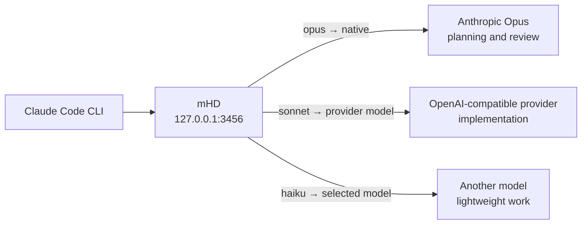
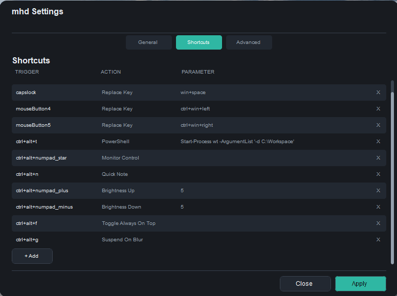
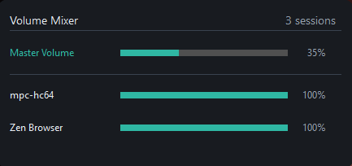
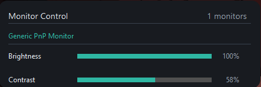
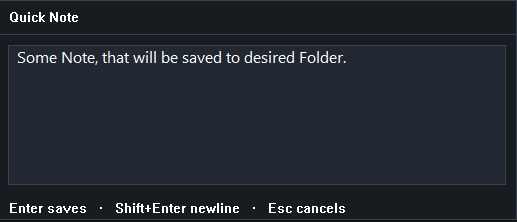
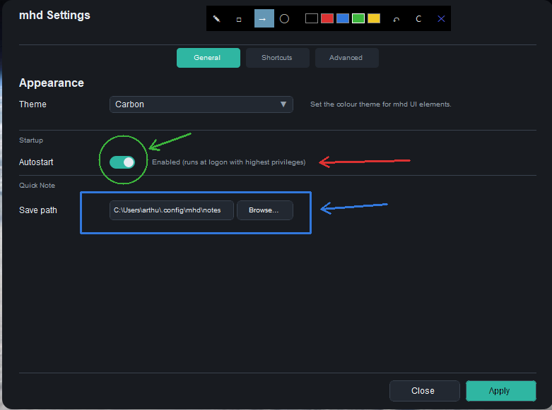
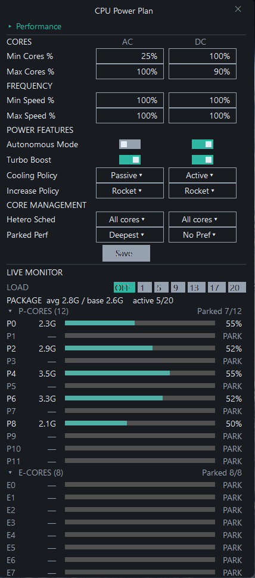
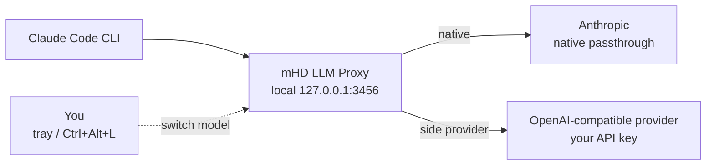
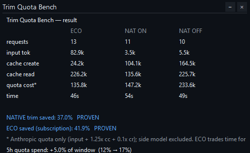

# mHD


**A Windows key daemon and desktop control layer with a built-in LLM proxy for Claude Code.**

mHD started as a personal always-on key daemon: one small native tray process for remapping keys and mouse buttons, binding global shortcuts, launching actions, and opening compact desktop panels without pulling in a heavy automation suite.

The second major part is the LLM proxy. It lets Claude Code keep running while `opus`, `sonnet`, and `haiku` routes are switched or delegated to cheaper models across Anthropic and any OpenAI-compatible provider. The main point is saving paid limits and context-budget pressure by moving mechanical work, sub-agents, and lightweight turns away from the expensive provider when they do not need the top model.

mHD also embeds request compression powered by a clean-room native trim engine. Trim can shrink verbose tool output, logs, diffs, repeated lines, and bulky JSON before a request is sent, without making an extra LLM call. The legacy [`llmtrim`](https://github.com/fkiene/llmtrim)-based engine remains available behind a toggle as a fallback.

**mHD** is a free, open-source Windows utility. Its core job is keyboard/mouse control: remap awkward inputs, turn hotkeys into actions, switch schemes, and keep small native tools one shortcut away.

The built-in local proxy for Claude Code maps Claude's `opus`, `sonnet`, and `haiku` tiers to native Anthropic or any OpenAI-compatible provider.

The route can be changed live from a global hotkey or the system tray. The next request uses the new model; an active streaming response is not interrupted.

The two main workflows are:

- make Windows input behave the way you want: `CapsLock -> Alt+Shift`, mouse thumb buttons for virtual desktops, brightness or mixer panels on hotkeys;
- keep Claude Code as the interface while mHD routes expensive and cheap model work independently.

The LLM proxy enables workflows such as:

- keep Opus as the lead for architecture and review;
- send implementation work and parallel sub-agents to a cheaper OpenAI-compatible model;
- route lightweight work to a smaller or faster model;
- compare models inside the same Claude Code session;
- return any tier to native Anthropic instantly.

There is no model handoff. Claude Code remains the interface and agent runtime while mHD chooses where each request is executed.

> [!NOTE]
> Claude Code is still required. Native routes use your existing Claude Code authentication; provider routes use the API key you configure in mHD.

## Quick Start: Key Daemon

1. Download the latest `mhd-v*-windows-x64.zip` from [GitHub Releases](https://github.com/ArthurkaX/mhd/releases) and extract it.
2. Run `mhd.exe`.
3. Open **System tray -> mHD -> right click -> Settings -> Shortcuts**.
4. Add or edit bindings for the actions you use most: `replace_key`, `show_volume_mixer`, `show_monitor_panel`, `quick_note`, `quick_draw`, `switch_power_plan`, or `toggle_topmost`.
5. Use **Reload config** from the tray after manual TOML edits.

Example bindings:

```toml
[[binding]]
trigger = "capslock"
action = "replace_key"
keys = "alt+shift"

[[binding]]
trigger = "mouseButton4"
action = "replace_key"
keys = "ctrl+win+left"

[[binding]]
trigger = "ctrl+alt+numpad_star"
action = "show_volume_mixer"
```

## Quick Start: LLM Proxy

1. Download the latest `mhd-v*-windows-x64.zip` from [GitHub Releases](https://github.com/ArthurkaX/mhd/releases) and extract it.
2. Run `mhd.exe`.
3. Open **System tray -> mHD -> right click -> Settings -> LLM Proxy**.
4. Add an OpenAI-compatible provider:
   - endpoint: the provider's `/v1` base URL;
   - API key: the provider API key;
   - models: the provider model IDs you want to use.
5. In **Settings -> Shortcuts**, bind `show_llm_models` to a key such as `Ctrl+Alt+L`.
6. Add the extracted directory to `PATH`, then launch Claude Code through the included wrapper:

   ```powershell
   claude-mhd
   ```

7. Press the hotkey and assign a target to `opus`, `sonnet`, or `haiku`.

The wrapper points Claude Code at the local proxy on `127.0.0.1:3456`. It also identifies Claude Code sub-agents as Sonnet 4.6, so the Sonnet tier can be routed to a separate provider or model.




Each tier keeps routing automatically after selection. Unlike a static model-name proxy, mHD lets you change the routing table at runtime without editing configuration or restarting Claude Code.

See [LLM Proxy documentation](llm-proxy/README.md) for provider setup, routing behavior, tracing, and configuration details.

---

## At A Glance

| Area | What mHD does |
|------|---------------|
| Key daemon | Keyboard remaps, mouse bindings, global shortcuts, scheme switching |
| Shortcut actions | PowerShell commands, program launch, hotkey-driven desktop control |
| LLM Proxy | Live per-tier routing for Claude Code across Anthropic and OpenAI-compatible providers |
| Request Compression | Built-in native trim engine for Claude Code and OpenAI-compatible proxy traffic (legacy llmtrim behind a toggle) |
| Display | DDC/CI brightness, VCP control, monitor panel, brightness OSD |
| Audio | Master volume, per-app mixer, media key actions |
| Desktop tools | Quick Note, Quick Draw, Pomodoro, Breathe, power panel, CPU plan panel, screenshot vision tools |
| Window/process control | Always-on-top, suspend-on-blur, throttle-on-blur |
| Settings | Native config editor, theme selection, autostart, shortcut editing |

---

## Native Windows Utility Layer

mHD is primarily a compact desktop control layer for Windows. It is useful when you want one daemon to handle:

- keyboard and mouse remapping;
- shortcut-driven automation;
- monitor brightness and DDC/CI control;
- per-app volume control;
- media keys;
- quick notes;
- quick drawing;
- Pomodoro timing;
- power plan switching;
- window always-on-top toggling;
- process suspend/throttle behaviour;
- small native control panels available from hotkeys or tray.

It ships as a single `mhd.exe`: no driver, service, WebView2, or heavyweight UI framework.

---

## Screenshots



Config editor with shortcut bindings and action selection.

### Native utility panels

| Volume Mixer | Monitor Control |
|--------------|-----------------|
|  |  |

| Quick Note | Quick Draw |
|------------|------------|
|  |  |

### CPU power plan panel



---

## Runtime Model

`mhd.exe` runs as one process with several internal threads:

```text
mhd.exe
├── Tray thread
│   ├── system tray icon and menu
│   ├── About dialog
│   ├── config editor
│   └── quick access to utility overlays
├── Hook thread
│   ├── WH_KEYBOARD_LL and WH_MOUSE_LL hooks
│   └── trigger capture and suppression
├── Worker thread
│   ├── action dispatch
│   ├── PowerShell / program launch
│   ├── DDC/CI monitor control
│   └── power plan switching
├── OSD thread
│   └── native brightness overlay
└── Overlay threads
    ├── volume mixer
    ├── monitor panel
    ├── power panel
    ├── quick draw
    ├── quick note
    ├── pomodoro timer
    ├── CPU power panel
    └── other native utility windows
```

The design goal is to keep the daemon responsive and the UI native. The hooks do their work without dragging in heavyweight UI frameworks or polling loops.

---

## Product Features

### Hotkey and mouse bindings

mHD listens for low-level keyboard and mouse events and maps them to actions. A binding can:

- replace a key or shortcut with another key sequence;
- launch a program;
- run a PowerShell command;
- open a utility overlay;
- switch binding schemes;
- control audio, brightness, or power state;
- toggle process behaviour such as suspend/throttle/topmost.

Bindings are configured in TOML. The action parser supports both simple one-field actions and structured actions with parameters.

### Key remapping

`replace_key` suppresses the original input and emits a replacement key combo through `SendInput`. This is the core remapping feature for key layout changes and ergonomic remaps.

Examples:

- `capslock -> alt+shift`
- side mouse button -> `ctrl`
- a dead key -> a custom shortcut

### Mouse bindings

Mouse buttons can be bound the same way as keyboard triggers. The codepath handles button down/up suppression so a remap behaves like a real input replacement rather than a duplicate event.

### DDC/CI monitor control

mHD can talk to monitors through DDC/CI and supports:

- absolute brightness changes;
- relative brightness changes;
- arbitrary VCP codes;
- a monitor panel overlay for direct adjustment.

This is useful for external displays that expose brightness, input select, or other VCP controls over the I2C/DDC path.

### Brightness OSD

When brightness changes, mHD can show a native OSD. It is built as a layered Win32 window, not as a framework widget. The OSD is meant to be minimal, readable, and quick to dismiss.

### Volume mixer

The built-in mixer shows:

- master output volume;
- individual per-application audio sessions;
- per-row mute and volume adjustment;
- mouse wheel volume changes while hovering a row.

It is designed as an interactive native window for day-to-day control without opening the full Windows sound UI.

### Power controls

mHD includes actions for:

- switch to sleep / shutdown / wake-oriented power actions;
- switch active Windows power plans;
- edit processor power settings from the CPU power panel;
- inspect live per-core CPU load and core topology;
- toggle process suspension when a window loses focus;
- toggle aggressive throttling when a process loses focus;
- toggle always-on-top for the focused window.

These actions are intended for people who want a small, direct utility layer rather than a large automation suite.

### Utility overlays

The included overlays are:

- About dialog
- Monitor panel
- Power control panel
- Quick Draw
- Quick Note
- Pomodoro timer
- Breathe pacer
- CPU power panel
- KeyCast keystroke overlay
- Vision Screenshot and Vision Snip

Each one is a native window with a narrow task and a minimal control surface.

Quick Draw is a transparent drawing layer with pencil, rectangle, circle, and arrow tools, a small colour picker, undo, clear, and close controls. Drawings remain in memory while the overlay is hidden.

Quick Note is a hotkey popup for short Markdown notes. Enter saves, Shift+Enter inserts a new line, Escape cancels, and a second hotkey press closes the popup without saving. Notes are written by day into the configured notes directory.

The Pomodoro tool keeps its timer state in a background thread, so the overlay can be opened and closed without losing the current timer. It supports task text, start/pause/stop, five-minute extension, break timing, and completion feedback.

The Breathe pacer visualises paced resonance breathing at 6 breaths per minute using an expanding/contracting sphere. Three presets are available: `balanced` (10 min, 5-5), `calm` (15 min, 4-6), and `extended` (20 min, 4-6). When invoked without a preset, the tool auto-selects by time of day. The overlay supports pause/resume (snap-back to the beginning of inhale), mute, and quit. Completion beeps and logs to blackbox when enabled.

KeyCast shows pressed keys and mouse clicks in a small overlay for recordings and streams. It can be toggled from the tray or assigned to a shortcut with `toggle_keycast`.

The Settings window exposes KeyCast position and display duration. Manual `[keycast]` settings can choose one of six positions: `top_left`, `top_center`, `top_right`, `bottom_left`, `bottom_center`, or `bottom_right`.

The CPU power panel can switch Windows power plans, edit processor parking and frequency-related power settings, show live per-core load, expose P/E core topology when Windows reports it, and run a small local stress load for testing plan behaviour.

If a configured provider has a vision-capable model, mHD can send a full-screen screenshot to it with your prompt, or open an interactive snip tool where you crop and mark up the screenshot before analysis.

### LLM Proxy

mHD includes a local LLM proxy for Claude Code. Its main job is limit-aware runtime model routing: start Claude Code once through the proxy, then move `opus`, `sonnet`, and `haiku` traffic between Anthropic native models and cheaper OpenAI-compatible provider models from the tray or a hotkey, without restarting Claude Code, mHD, or the current conversation.

This is meant for workflows where the expensive model should stay available for planning, architecture, review, and hard turns, while implementation loops, sub-agents, or lightweight requests can be delegated to cheaper models outside a single provider.

Typical flow:

1. Run mHD.
2. Start Claude Code through [`claude-mhd.bat`](claude-mhd.bat), for example `C:\Workspace\Active\mhd\claude-mhd.bat`. The wrapper points `ANTHROPIC_BASE_URL` at the local proxy on `127.0.0.1:3456`.
3. Open **System tray -> mHD -> right click -> Settings -> LLM Proxy**.
4. Add an OpenAI-compatible provider, API key, and models.
5. Assign a shortcut for `show_llm_models` on the **Shortcuts** page. For example, `Ctrl+Alt+L`.
6. Press the shortcut while Claude Code is running and choose the target model for `opus`, `sonnet`, or `haiku`.

The selected route applies to the next Claude Code request. In-flight streams continue on the model they started with, so switching is safe during an active session.

Routing targets can be:

- `native` - pass through to Anthropic, forwarding Claude Code's OAuth token.
- any configured OpenAI-compatible model - use your provider API key for the next request.

Two optional features build on this:

- **Request Compression (Trim)** - a built-in, clean-room native trim engine. A single toggle deterministically shrinks outgoing requests (verbose tool output, logs, diffs, duplicate lines, bulky JSON) without busting the Anthropic prompt cache, with no extra model calls. It applies to both Claude Code and OpenAI-compatible traffic. The legacy [`llmtrim`](https://github.com/fkiene/llmtrim)-based engine remains selectable as a fallback via the `trim_engine` toggle.
- **OpenAI-compatible clients** - editors like Zed can point at the same proxy (`http://127.0.0.1:3456/v1`) for streaming, a `/v1/models` list, and the same compression, and they show up in the Proxy Trace too.



The built-in **Trim Quota Bench** measures the real quota impact of compression by running the same workload three ways (ECO / native trim ON / native trim OFF) and comparing the weighted quota cost, per-arm time, and the share of the live 5-hour quota window each run consumes.



See [llm-proxy/README.md](llm-proxy/README.md) for setup details, provider configuration, runtime switching, trace view, and the proxy configuration files.

### Config editor and tray

The tray provides the operational entry point:

- reload config;
- edit config;
- open utility windows;
- inspect and toggle supported features;
- switch themes;
- enable or disable autostart;
- choose the Quick Note directory;
- open config, log, and crash-log locations;
- switch LLM proxy models;
- reset shortcuts or all settings;
- quit cleanly.

The config editor is a native Win32 interface with tabs for appearance, shortcuts, and advanced maintenance. Shortcut editing uses the same action registry as the TOML parser, so new action names and parameter types stay consistent between hand-written config and the UI.

### Diagnostics

Normal builds write panic details to:

```text
%USERPROFILE%\.config\mhd\crash.log
```

Developer builds can also be compiled with `debug-dump` to write minidumps and an additional debug log under `%TEMP%`:

```powershell
cargo build --release --features debug-dump
```

---

## Build

### Default build

```powershell
cargo build --release
```

This produces the normal public build. Optional developer features are disabled by default.

### Release package

The public release archive is portable and contains the normal build only:

```powershell
.\scripts\package-release.ps1 -Version 0.4.0
```

The script creates:

```text
dist\mhd-v0.4.0-windows-x64.zip
dist\mhd-v0.4.0-windows-x64.zip.sha256
```

Attach both files to the matching GitHub Release tag, for example `v0.4.0`.

---

## Run

```powershell
.\mhd.exe              # tray + daemon
.\mhd.exe --daemon     # headless, no tray
.\mhd.exe --quiet      # suppress startup messages
.\mhd.exe --debug-quicknote  # print QuickNote lifecycle/debug events
```

---

## Configuration

On first run, mHD creates:

```text
%USERPROFILE%\.config\mhd\config.toml
```

You can override the config path with:

```powershell
$env:MHD_CONFIG = "C:\path\to\config.toml"
```

The main config file is TOML. It can define:

- startup binding scheme;
- active theme;
- volume step;
- autostart;
- quick note settings;
- power plan order;
- optional developer-only blackbox settings when compiled with that feature;
- bindings.

LLM proxy settings are managed through the native settings UI and stored under:

```text
%USERPROFILE%\.config\mhd\llm-proxy\
```

Optional KeyCast placement can be configured manually:

```toml
[keycast]
position = "bottom_center"
duration_ms = 1200
```

---

## Actions

The action list below matches the parser in `mhd-daemon/src/core/action.rs`.

### Input

| Action | Fields | Behaviour |
|--------|--------|-----------|
| `replace_key` | `keys` | Suppress the trigger and emit a replacement key combo via `SendInput`. |
| `run_program` | `path` | Launch a program or file path directly. |

### Automation

| Action | Fields | Behaviour |
|--------|--------|-----------|
| `run_ps` | `command` | Run a PowerShell command. |
| `switch_scheme` | `target_scheme` | Change the active binding scheme at runtime. |

### Display

| Action | Fields | Behaviour |
|--------|--------|-----------|
| `set_brightness` | `value` | Set brightness absolutely or relatively, depending on prefix. |
| `brightness_up` | `value` | Increase brightness by the configured step. |
| `brightness_down` | `value` | Decrease brightness by the configured step. |
| `vcp` | `code`, `value` | Set or adjust an arbitrary VCP control code. |
| `show_monitor_panel` | - | Open the monitor control overlay. |

### Audio / Media

| Action | Fields | Behaviour |
|--------|--------|-----------|
| `show_volume_mixer` | - | Open the interactive mixer window. |
| `media_volume_up` | - | Send one volume-up media key step. |
| `media_volume_down` | - | Send one volume-down media key step. |
| `media_mute` | - | Toggle system mute. |
| `media_play_pause` | - | Play or pause the active media session. |
| `media_stop` | - | Stop playback. |
| `media_last_track` | - | Go to the previous track. |
| `media_next_track` | - | Go to the next track. |

### System

| Action | Fields | Behaviour |
|--------|--------|-----------|
| `toggle_topmost` | - | Toggle always-on-top for the focused window. |
| `toggle_suspend_on_blur` | - | Suspend the focused process when it loses focus. |
| `toggle_throttle_on_blur` | - | Apply Windows power throttling and one-CPU affinity when a process loses focus. |
| `power_actions` | - | Open the power actions panel. |
| `switch_power_plan` | `target` | Switch to a named power plan or `next`. |
| `show_cpu_panel` | - | Open the CPU power plan panel. |
| `quit` | - | Shut mHD down cleanly. |

### Tools

| Action | Fields | Behaviour |
|--------|--------|-----------|
| `quick_draw` | - | Open the quick drawing overlay. |
| `quick_note` | - | Open the quick note overlay. |
| `pomodoro` | - | Open the Pomodoro timer overlay. |
| `breathe` | `preset` | Open the Breathe pacer. Optional preset: `balanced`, `calm`, `extended`, or omit for time-of-day auto-select. |
| `toggle_keycast` | - | Toggle the KeyCast keystroke overlay. |
| `vision_screenshot` | - | Capture the screen, analyze it with the configured vision model, and copy the result. |
| `vision_snip` | - | Capture, crop, annotate, and analyze a screenshot with the configured vision model. |

### LLM Proxy

| Action | Fields | Behaviour |
|--------|--------|-----------|
| `show_llm_models` | - | Open the model selector overlay to switch proxy routing on the fly. |
| `toggle_llm_proxy` | - | Enable or disable the LLM proxy server at runtime. |

---

## Example Bindings

The main use case for `replace_key` is taking a shortcut that is annoying, hard to reach, or difficult to change in Windows or in another application, and mapping it to something easier. mHD can turn one key or mouse button into a full key combination, so you do not have to accept the defaults chosen by Windows or by the app.

```toml
# Quit mHD.
[[binding]]
trigger = "ctrl+alt+f12"
action = "quit"

# CapsLock -> Alt+Shift.
# Useful when Alt+Shift is your Windows keyboard layout switch:
# one key changes language/layout instead of a two-key chord.
[[binding]]
trigger = "capslock"
action = "replace_key"
keys = "alt+shift"

# Mouse side buttons -> virtual desktop navigation.
# Windows uses Ctrl+Win+Left/Right for this, which is not comfortable
# during normal mouse-driven work. mHD can put that action under your thumb.
[[binding]]
trigger = "mouseButton4"
action = "replace_key"
keys = "ctrl+win+left"

[[binding]]
trigger = "mouseButton5"
action = "replace_key"
keys = "ctrl+win+right"

# Brightness up / down through DDC/CI.
# Useful for external monitors where Windows brightness controls do not work.
[[binding]]
trigger = "ctrl+alt+numpad_add"
action = "brightness_up"
value = "5"

[[binding]]
trigger = "ctrl+alt+numpad_subtract"
action = "brightness_down"
value = "5"

# Open the compact volume mixer instead of the Windows sound settings.
[[binding]]
trigger = "ctrl+alt+numpad_star"
action = "show_volume_mixer"

# Suspend the focused app when it loses focus.
# Useful for heavy games/tools that should stop consuming resources in background.
[[binding]]
trigger = "ctrl+alt+f9"
action = "toggle_suspend_on_blur"

# Throttle the focused app when it loses focus.
# Less aggressive than suspend: the process keeps running, but with reduced CPU pressure.
[[binding]]
trigger = "ctrl+alt+f10"
action = "toggle_throttle_on_blur"

# Launch Windows Terminal from a shortcut.
[[binding]]
trigger = "ctrl+alt+t"
action = "run_ps"
command = "Start-Process wt"

# Open the Breathe pacer with the time-of-day preset.
[[binding]]
trigger = "ctrl+alt+b"
action = "breathe"

# Open the Breathe pacer with the calm preset (15 min, 4-6 ratio).
[[binding]]
trigger = "ctrl+alt+shift+b"
action = "breathe"
preset = "calm"

```

---

## Themes

mHD loads JSON colour themes from:

```text
%USERPROFILE%\.config\mhd\themes
```

Set the active theme in `config.toml`:

```toml
theme = "night_glass"
```

The file must exist at:

```text
%USERPROFILE%\.config\mhd\themes\night_glass.json
```

Supported keys:

| Key | Used for |
|-----|----------|
| `background` | OSD, About, editor, mixer background |
| `surface` | Edit control background |
| `border` | Separator lines |
| `text` | Primary text |
| `text.muted` | Labels, version, hints, status, secondary text |
| `element.active` | Accent / progress bar fill |
| `element.selected` | Selection highlight |
| `element.hover` | Hover state |

Missing keys fall back to the built-in default theme.

On first run, mHD also creates bundled theme files when they are missing:

- `carbon`
- `paper`
- `night_glass`
- `day_glass`
- `ember`

---

## Project Structure

```text
mhd/
├── Cargo.toml
├── llm-proxy/
│   ├── Cargo.toml
│   └── src/
│       ├── main.rs
│       ├── config.rs
│       ├── handlers.rs
│       ├── state.rs
│       └── providers/
│           ├── mod.rs
│           ├── anthropic.rs
│           └── upstream.rs
└── mhd-daemon/
    ├── Cargo.toml
    └── src/
        ├── main.rs
        ├── app.rs
        ├── core/
        │   ├── action.rs
        │   ├── hook.rs
        │   ├── llm_proxy.rs
        │   ├── native_theme.rs
        │   ├── platform.rs
        │   ├── trigger.rs
        │   └── worker.rs
        ├── config/
        │   ├── mod.rs
        │   ├── raw.rs
        │   └── path.rs
        ├── overlays/
        │   ├── about.rs
        │   ├── autostart.rs
        │   ├── cpu_plan.rs
        │   ├── draw.rs
        │   ├── llm_models.rs
        │   ├── monitor.rs
        │   ├── note.rs
        │   ├── pomodoro.rs
        │   ├── power.rs
        │   ├── suspend.rs
        │   ├── throttle.rs
        │   ├── topmost.rs
        │   ├── tray.rs
        │   └── volume.rs
        ├── osd/
        │   ├── mod.rs
        │   └── painter.rs
        ├── renderer.rs
        └── win32/
            ├── mod.rs
            └── text_host.rs
```

---

## Optional Developer Build

The normal release build does not include `blackbox`.

`blackbox` is an optional local-only module I use for personal productivity analysis. It records activity into a SQLite database, so I can later ask an LLM to summarize how this computer was used and where time went.

It writes to:

```text
%USERPROFILE%\.config\mhd\blackbox\blackbox.db
```

Build it explicitly when you want that local diagnostic/history layer:

```powershell
cargo build --release --features blackbox
```

It is intentionally opt-in, not enabled in public builds, and should be treated as a private developer build option.
