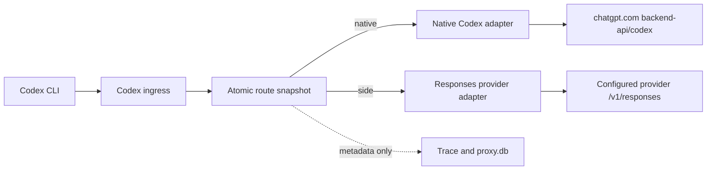

# Codex OAuth Proxy: Implementation Plan

Status: P0, native P1, H3 endpoint verification, and the initial Codex route slot completed; side canary and H4 session validation pending  
Last updated: 2026-08-02  
Validated Codex version: `codex-cli 0.146.0`

## 1. Goal

Add Codex routing to mHD with the same user experience already available for
Claude Code:

```text
Codex CLI (ChatGPT OAuth) -> mHD
  ├─ native -> official ChatGPT Codex backend, original OAuth
  └─ side   -> configured Responses-compatible provider, mHD API key
```

The user launches Codex once through the local mHD endpoint. Changing the Codex
route affects the next request only; an active stream remains attached to the
route selected when that request started.

mHD never converts OAuth into an API key:

- the native route forwards the incoming OAuth token to the official Codex
  backend;
- the side route removes all incoming OpenAI credentials and signs the rebuilt
  request with the configured provider key.

## 2. Current Working State

The following properties have been verified with Codex CLI 0.146.0 and a real
ChatGPT OAuth session:

- `openai_base_url=http://127.0.0.1:3456/v1` redirects Codex model traffic to
  mHD without changing the global Codex configuration;
- Codex sends `GET /v1/models?client_version=0.146.0`;
- Codex first attempts a WebSocket upgrade on `GET /v1/responses`;
- after a `404`, Codex automatically falls back to HTTPS
  `POST /v1/responses` with SSE;
- request bodies use `content-type: application/json` and
  `content-encoding: zstd`;
- OAuth and required Codex headers reach the local proxy;
- native HTTPS passthrough to
  `https://chatgpt.com/backend-api/codex/responses` works end-to-end;
- a live canary returned `OK` through mHD with exit code `0`;
- the `codex-mhd.bat` launcher provides a per-process base URL override.

Current request path:

```text
codex-mhd
  -> http://127.0.0.1:3456/v1/responses
  -> mHD native Codex adapter
  -> https://chatgpt.com/backend-api/codex/responses
```

The WebSocket warning is expected in the current MVP. HTTPS/SSE fallback is
fully functional.

## 3. Completed Work

### P0: Wire Probe

Implemented `codex_wire_probe` as a development-only binary. It:

- binds only to `127.0.0.1`;
- accepts arbitrary paths and methods;
- reports only safe request structure;
- reports sensitive headers as `present=true` without values;
- never persists request bodies;
- returns the distinctive marker `mhd_codex_probe`.

The probe established the real Codex request sequence and confirmed that OAuth
traffic can be routed to localhost.

### P1: Native OAuth Passthrough MVP

Implemented a dedicated native Codex provider:

- Codex model discovery is forwarded only when the request contains OAuth and
  `client_version`;
- `/v1/responses` request bytes are forwarded without parsing or mutation;
- zstd content encoding is preserved;
- upstream SSE is streamed back without semantic transformation;
- HTTP status and relevant response headers are preserved;
- only an explicit request-header allowlist is forwarded;
- ordinary OpenAI `/v1/models` clients still receive the local mHD model list;
- WebSocket attempts receive a quick `404`, triggering the supported HTTPS
  fallback.

Validation completed:

- `cargo test -p mhd-llm-proxy --lib`: 234 passed;
- `cargo check --workspace`: passed;
- `cargo build --workspace`: passed;
- real Codex OAuth canary through mHD: passed.

### P2/P3: Side Candidate and Codex Route Slot

The configured SVA gateway was probed without ChatGPT credentials. Its
`POST /v1/responses` endpoint returned a Responses-specific virtual-key error,
confirming that the API is present and that authentication is enforced at the
Responses layer. The probe did not send OAuth, prompts, or account metadata.

The first routing slot is now implemented as `codex_target`:

- default is `native`;
- `POST /set_model/codex` accepts `{"id":"native"}` or a provider model id;
- each request snapshots the target before forwarding;
- native requests retain the OAuth-only allowlist;
- side requests decompress zstd, replace `model`, rebuild headers, and send
  only the configured upstream key as `x-bf-vk`;
- route changes persist in `settings.json` for standalone mode;
- native HTTP clients now reject redirects, preventing OAuth forwarding to an
  unexpected host.

The SVA side path still needs a credentialed canary, tool-loop coverage, and
explicit compatibility/error tests before it should be enabled by default.

## 4. Target Architecture



New routing concepts should remain separate from the existing Claude tiers:

```rust
enum ClientKind {
    ClaudeCode,
    Codex,
    OpenAi,
}

enum CodexTarget {
    Native,
    Model(ModelRef),
}

enum WireApi {
    AnthropicMessages,
    ChatCompletions,
    Responses,
}
```

The first implementation should have one routing slot named `codex`. Do not
guess main-agent/subagent roles from body size or model name.

## 5. P2: Verify a Side Provider

Before implementing side routing, identify one configured provider that
actually supports the Responses API.

### H3: Responses Compatibility

For each candidate provider, safely verify:

- endpoint discovery and `/v1/responses` availability;
- text-only streaming;
- function definitions and function calls;
- function results in subsequent input;
- parallel tool calls;
- reasoning items and summaries;
- usage reporting;
- cancellation;
- context-limit and authentication errors;
- zstd request support, or whether mHD must decompress before forwarding.

Do not send ChatGPT OAuth or `x-codex-*` account metadata during this probe.

Acceptance criteria for the first side provider:

- 30 successful turns;
- at least 10 complete tool loops;
- no manual payload repair;
- no leaked native credentials;
- a clear compatibility error for unsupported item/event types.

If no required provider supports `/v1/responses`, skip to P5 and build a
dedicated Responses-to-Chat-Completions adapter. Do not reuse the existing
Anthropic translator as if the protocols were equivalent.

## 6. P3: Codex Routing Slot

Add a dedicated Codex target to shared `AppState` and `ProxyControl`.

Required behavior:

- default target is `native`;
- the handler snapshots the target once at request start;
- updating the target is atomic;
- an in-flight stream remains on its original route;
- the next request uses the new target;
- the selected target can be persisted by standalone mode;
- embedded daemon mode remains controlled by daemon settings;
- existing Opus/Sonnet/Haiku/Fable slots remain unchanged.

Suggested control interface:

```rust
control.set_codex_target("native");
control.set_codex_target("provider/model-id");
control.codex_target();
```

The `/set_model/codex` endpoint may use the same external shape as existing
slots, but must resolve into `CodexTarget`, not a Claude `Tier`.

## 7. P4: Side Responses Passthrough

### Outbound Request Rules

For a side route:

1. Read the compressed request bytes.
2. Decompress zstd only when model replacement or provider compatibility
   requires body mutation.
3. Parse the Responses request using a tolerant structural representation.
4. Replace the incoming model with the configured upstream model ID.
5. Remove native-only continuation or item fields only when the provider is
   known not to support them; otherwise preserve them.
6. Rebuild all outbound headers from scratch.
7. Apply the provider API key from mHD secrets.
8. Never forward incoming `Authorization`, cookies, account/workspace IDs,
   `x-codex-*`, or internal ChatGPT headers.

Do not change tool names, `call_id` values, item ordering, or function-result
relationships.

### Response Rules

- Preserve valid Responses SSE events and ordering.
- Parse events incrementally for metadata and compatibility checks.
- Do not buffer the full response before returning it to Codex.
- Do not treat HTTP 200 as success until a terminal Responses event is seen.
- Preserve cancellation: dropping the downstream body must cancel upstream
  streaming work.
- Unknown events should fail with an explicit provider compatibility message
  unless they are proven safe for Codex to ignore.

No automatic fallback from side to native is allowed by default. Silent
fallback could unexpectedly consume the user's subscription quota and cross a
privacy boundary.

## 8. P5: Responses-to-Chat-Completions Adapter (Optional)

Implement this phase only if important real providers do not support Responses.

Required transformations include:

- Responses input items to Chat Completions messages;
- Responses function tools to Chat Completions tools;
- tool calls and function results in both directions;
- reasoning fields only where the destination provider has a documented
  equivalent;
- Chat Completions stream deltas to valid Responses SSE events;
- finish reasons, usage, errors, and cancellation.

The adapter must reject non-portable items explicitly. It must not silently
drop encrypted reasoning, hosted tools, computer-use items, or unknown item
types.

## 9. P6: Hot-Switch Session Validation

### H4: Same-Session Portability

Test this matrix in one Codex session:

| Turn | Route | Expected result |
|---|---|---|
| 1 | native | Establish context and complete a tool call |
| 2 | side A | Continue using the previous tool result |
| 3 | native | Return without restart or resume |
| 4 | side B | Switch model again |

Repeat the complete `native -> side -> native` cycle at least three times.

Pay special attention to:

- `previous_response_id`, which may refer to server-side state unavailable to
  another provider;
- encrypted reasoning items tied to a backend or model;
- provider-specific item types;
- differing tool/capability contracts;
- context reconstructed by Codex versus context stored only by the backend.

Preferred portability mode is stateless/full-input. If Codex relies on
backend-owned continuation state, mHD must either materialize portable context
or block cross-provider switching for that session with a clear explanation.
Never silently remove `previous_response_id`.

## 10. P7: Daemon UI and Launcher

Add Codex controls to the existing mHD user experience:

- a visible Codex route selector;
- `Native (ChatGPT OAuth)` as the default target;
- provider/model choices filtered by Responses compatibility;
- current route shown in tray/overlay state;
- a hotkey action for cycling or selecting the Codex target;
- a warning badge for experimental adapters;
- a health indicator for mHD availability.

Keep `codex-mhd.bat` as the preferred launcher:

```bat
codex-mhd [args...]
```

It should apply only the per-process `openai_base_url` override and leave the
user's global Codex configuration untouched.

## 11. P8: Telemetry

Record metadata only:

- `client_kind = codex`;
- `wire_api = responses`;
- native OAuth versus side API-key route type, without credential values;
- requested and effective model;
- selected provider;
- route-switch timestamp;
- request status and duration;
- input/output/cache/reasoning usage when reported;
- terminal event, cancellation, and compatibility error class.

Do not store full Codex request/response bodies by default. Do not include
OAuth, API keys, prompts, tool outputs, account IDs, window IDs, or turn
metadata in Trace or SQLite.

ChatGPT subscription quota and PAYG/provider usage must remain separate budget
entities even if route markers are displayed on the same activity timeline.

## 12. WebSocket Support

WebSocket passthrough is not required for functional MVP because Codex has a
working HTTPS fallback. It is still desirable because the current fallback:

- prints a warning;
- performs several reconnect attempts;
- adds startup latency.

Implement WebSocket only after side routing is stable. Requirements:

- validate the upgrade request;
- forward OAuth only to the fixed official ChatGPT hostname;
- bridge frames without interpreting prompt content;
- propagate close/cancel behavior;
- pin each connection/request to its route snapshot;
- provide the same credential isolation guarantees as HTTPS.

## 13. Security Requirements

- Native OAuth may be sent only to the compile-time official host
  `chatgpt.com` and the fixed `/backend-api/codex` path family.
- Disable redirects for native OAuth requests, or reject them before resending
  credentials.
- Side requests must rebuild headers from scratch.
- Provider endpoints must reject embedded URL credentials.
- No automatic side-to-native fallback.
- No body dumps for Codex without a separate explicit development opt-in.
- Add sentinel-secret tests proving that side requests, Trace, SQLite, and
  stderr contain no native credentials.
- Bind the local proxy to loopback by default.

## 14. Test Strategy

### Unit Tests

- native header allowlist;
- side header scrubber;
- official-host and path validation;
- redirect rejection;
- zstd round-trip when mutation is required;
- model substitution;
- route snapshot semantics;
- fragmented SSE parsing;
- terminal/error/cancel events;
- unknown item/event behavior;
- absence of sentinel secrets in telemetry.

### Integration Tests

Use local fake backends:

- fake native backend verifies OAuth passthrough;
- fake side backend verifies OAuth stripping and provider-key insertion;
- scripted Responses streams cover text, tools, usage, errors, and malformed
  events;
- client disconnect verifies upstream cancellation;
- parallel requests during route switching verify that active streams remain
  pinned.

### Live Canary

- use an empty temporary repository;
- use minimal prompts;
- validate native first;
- validate one side provider next;
- run the H4 switching matrix;
- repeat the wire-contract smoke test after every supported Codex upgrade.

## 15. Delivery Order

1. Completed: safe wire probe and H1 validation.
2. Completed: native HTTPS/SSE passthrough and live canary.
3. Next: side-provider Responses capability probe.
4. Add Codex route state and control API.
5. Add one Responses-compatible side provider.
6. Validate same-session hot switching.
7. Add daemon UI/hotkeys and Codex telemetry.
8. Optionally add the Chat Completions adapter.
9. Optionally add WebSocket passthrough.
10. Evaluate Responses-aware trimming separately; never enable it implicitly.

Each stage should remain independently revertible. Side routing must stay behind
an explicit feature/runtime setting until H3 and H4 pass.

## 16. MVP Completion Criteria

The complete routing MVP is ready when all of the following are true:

- Codex launches through mHD with the existing ChatGPT OAuth session;
- native mode passes at least 20 consecutive synthetic turns;
- one side provider passes 30 turns and 10 tool loops;
- `native -> side -> native` works three times in one session;
- active streams are not interrupted by route changes;
- OAuth never leaves the official native branch;
- side providers receive only their configured mHD key;
- incompatibilities produce clear errors;
- returning to native is immediate;
- Claude Code, OpenAI clients, daemon, inspector, and telemetry tests do not
  regress.

## 17. Main Risks

| Risk | Likelihood | Impact | Mitigation |
|---|---:|---:|---|
| Side provider lacks Responses API | High | Blocks raw passthrough | Probe first; optional adapter later |
| Encrypted reasoning is backend-bound | High | Breaks hot switching | H4 capability gate; never silently drop |
| `previous_response_id` is backend-bound | Medium/High | Context loss | Prefer stateless input or block switching |
| Codex wire contract changes | Medium | Runtime failure | Versioned fixtures and smoke tests |
| OAuth leaks to a side provider | Low if tested | Critical | Header rebuild and sentinel tests |
| Redirect leaks OAuth | Low | Critical | Disable/fail redirects |
| Automatic fallback consumes quota | Medium | Bad UX/cost | Manual fallback only |
| HTTPS fallback startup delay | Certain | Minor | Add WebSocket after routing MVP |

## 18. Immediate Next Action

Inspect the configured mHD providers and select one candidate for H3. Probe its
`/v1/responses` endpoint without forwarding any ChatGPT credentials. If it
passes text streaming and one complete tool loop, implement the `codex` routing
slot and side passthrough for that provider. If it supports only Chat
Completions, document the incompatibility and decide whether it justifies the
separate P5 adapter.

## 19. Primary References

- Codex configuration schema:
  <https://github.com/openai/codex/blob/main/codex-rs/core/config.schema.json>
- Codex model provider implementation:
  <https://github.com/openai/codex/blob/main/codex-rs/model-provider-info/src/lib.rs>
- Codex configuration implementation:
  <https://github.com/openai/codex/blob/main/codex-rs/config/src/config_toml.rs>
- OpenAI Help: Codex CLI and ChatGPT sign-in:
  <https://help.openai.com/en/articles/11381614-api-codex-cli-and-sign-in-with-chatgpt>
