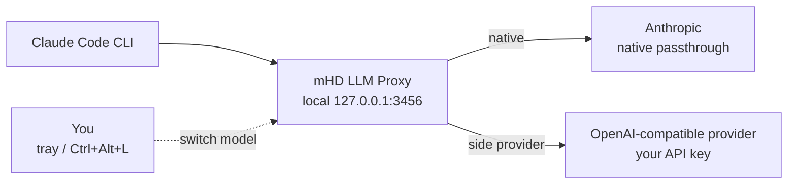

# mHD LLM Proxy

The mHD LLM proxy is a local Claude Code companion. It lets you keep Claude Code running while you switch model routing on the fly between Anthropic native models and OpenAI-compatible providers.

The practical goal is simple: start Claude Code once through the proxy, then use the mHD tray UI or a hotkey to move `opus`, `sonnet`, or `haiku` traffic to another provider and back without restarting Claude Code.

## Quick Start

1. Start `mhd.exe`.
2. Launch Claude Code through the repository wrapper:

   ```powershell
   C:\Workspace\Active\mhd\claude-mhd.bat
   ```

   The wrapper sets:

   ```bat
   ANTHROPIC_BASE_URL=http://127.0.0.1:3456
   ```

3. Open the mHD tray menu:

   ```text
   System tray -> mHD -> right click -> Settings -> LLM Proxy
   ```

4. Add an OpenAI-compatible provider:

   - provider name;
   - endpoint URL, usually ending in `/v1`;
   - API key;
   - one or more model IDs.

5. Open the **Shortcuts** page and bind `show_llm_models` (Claude Code) and `show_codex_models` (Codex) to separate keys.
6. Press the relevant shortcut and choose the active model route.

Claude Code does not need to be restarted. The next request uses the new route.

## What It Solves

Claude Code normally talks directly to Anthropic. The proxy inserts a local routing layer:



This is useful when you want to:

- keep an active Claude Code session open;
- switch `sonnet` or `haiku` to a cheaper or self-hosted provider;
- switch back to Anthropic native for harder work;
- compare models during the same workflow;
- avoid editing environment variables or restarting the CLI every time.

## Runtime Switching

The proxy keeps a live routing table for model tiers:

| Tier | Meaning |
|------|---------|
| `opus` | Requests whose incoming model name contains `opus`. |
| `sonnet` | Requests whose incoming model name contains `sonnet`. |
| `haiku` | Requests whose incoming model name contains `haiku`. |

Each tier can point to:

- `native` - forward the request to Anthropic;
- a configured upstream model ID - send the request to an OpenAI-compatible provider.

When you switch a tier in the model selector overlay, the proxy updates shared in-memory state and persists the choice. Active streaming responses are not interrupted. The new target is used by the next request for that tier.

## Claude Launcher

The repository includes [`../claude-mhd.bat`](../claude-mhd.bat):

```bat
@echo off
setlocal
set "ANTHROPIC_BASE_URL=http://127.0.0.1:3456"
REM set "ANTHROPIC_AUTH_TOKEN=unused"
call claude %*
```

Use it like the normal `claude` command:

```powershell
C:\Workspace\Active\mhd\claude-mhd.bat
C:\Workspace\Active\mhd\claude-mhd.bat --model sonnet -p "hi"
```

If you have normal Claude Code authentication, leave the wrapper as-is. For providers that do not require Anthropic authentication, the commented `ANTHROPIC_AUTH_TOKEN=unused` line can be enabled so the SDK has a token value to send.

## Zed Editor Integration

Zed and other OpenAI-native clients can use the proxy directly through the
OpenAI-compatible surface. Add a provider in Zed's `settings.json`:

```json
{
  "language_models": {
    "openai_compatible": {
      "mhd": {
        "api_url": "http://localhost:3456/v1",
        "api_key": "ignored-by-proxy",
        "available_models": [
          { "name": "sva-opencode/deepseek-v4-flash", "max_tokens": 1048576 }
        ]
      }
    }
  }
}
```

The proxy listens on `127.0.0.1:3456`. Zed adds `/chat/completions` and `/models`
to the base URL automatically, so `http://localhost:3456/v1` is all you need.

Each model `name` is forwarded to the upstream gateway as-is, so use IDs your
gateway understands (the same ones you would configure on the LLM Proxy page).
The `api_key` is not validated by the proxy (it uses its own configured keys),
but Zed requires the field to be present.

These requests share the same routing, streaming, `GET /v1/models` list, and
[Request Compression](#request-compression-trim) toggle as Claude Code traffic,
and they appear in the Proxy Trace overlay with their model and token counts.

## Provider Setup

Use the native settings UI:

```text
System tray -> mHD -> right click -> Settings -> LLM Proxy
```

The LLM Proxy page manages:

- proxy enabled state;
- bind address and port;
- OpenAI-compatible providers;
- provider endpoints;
- API keys;
- model lists;
- default tier targets;
- optional downgrade toggles;
- debug logging level.

Provider endpoints should be OpenAI-compatible chat/completions APIs, typically:

```text
https://your-provider.example/v1
```

Model IDs should match the provider's `/models` result or documented model names.

## Model Selector

Bind `show_llm_models` for Claude Code or `show_codex_models` for Codex from:

```text
Settings -> Shortcuts
```

Example shortcut:

```text
Ctrl+Alt+L
```

The Claude Code selector shows configured targets for each Claude tier. The Codex selector currently controls only the `gpt-5.4` route; other Codex models remain native. Pick `native` to return to the official provider, or pick one of your configured provider models.

## Tray Tools

The tray menu exposes the operational controls:

- **LLM Models** - open the model selector.
- **Claude Code: proxy** - route Claude Code through the proxy. Turning it off
  also stops the Anthropic OAuth usage poller, so mhd does no background work
  for a client you do not use.
- **Codex: proxy** - route Codex through the proxy. Turning it off also stops
  the Codex usage poller.
- **OpenAI: proxy** - route OpenAI-compatible clients (Zed / opencode / pi)
  through the proxy.
- **Proxy Trace** - inspect recent routing decisions.
- **Settings -> LLM Proxy** - configure providers, models, keys, and defaults.
- **Settings -> LLM Trim** - request compression, with an independent switch
  per client (Claude Code / OpenAI / Codex).

The listener runs only while at least one client is enabled. Turn all three
off and the proxy closes its port.

## Trace View

The proxy trace overlay shows recent requests and routing decisions. It is useful for checking:

- which tier Claude Code requested;
- which client sent the request (`Client` column: Claude Code / Codex / OpenAI),
  with a chip on the summary line to filter the view down to one client;
- which target the proxy selected;
- whether traffic went to Anthropic native or a provider;
- whether an automatic downgrade rule changed the target;
- whether [Request Compression](#request-compression-trim) shrank the request, and by how much;
- requests from OpenAI-compatible clients (e.g. Zed), shown with their model and token usage;
- Codex token usage, which the Responses API only reports in the terminal
  `response.completed` event — the row therefore stays in flight until the
  stream ends, and then fills in;
- whether requests are currently in flight.

## Configuration Files

The proxy stores its configuration under:

```text
%USERPROFILE%\.config\mhd\llm-proxy\
```

Files:

| File | Purpose |
|------|---------|
| `settings.json` | Enabled state, port, bind address, log level, upstream base URL, tier targets, downgrade toggles. |
| `secrets.json` | Anthropic and upstream API keys, protected through Windows DPAPI. |
| `providers.json` | OpenAI-compatible provider names and endpoints. |
| `models.json` | Selectable model IDs, display names, providers, and tier tags. |
| `proxy.db` | Request trace, token usage, quota snapshots, and bench runs. |
| `corpus-<provider>.db` | Captured pre-trim request bodies, one file per provider, used by the offline bench and tuning tools. |

One corpus file per provider rather than one shared table, because retention is
a row count: a small Codex body and a large Claude Code body cost one row each,
so a burst from one client used to evict the other's history one for one. Each
file now expires on its own schedule, which means `corpus_max_rows` is a
per-file cap and total rows on disk can reach that cap times the number of
providers.

Older databases keep their bodies in a `request_bodies` table inside
`proxy.db`; the tools still read it, and `corpus_migrate` moves the rows out
(run it with `--dry-run` first).

Older `[llm_proxy]` TOML settings are migrated into these files on startup.

## Routing View

```text
Claude Code CLI
  -> mHD LLM Proxy
  -> Anthropic native
  or
  -> OpenAI-compatible provider
```

For native Anthropic routes, Claude Code's existing auth is passed through. For provider routes, mHD uses the API key configured on the LLM Proxy settings page.

## Smart Downgrade

Manual switching is the primary control. Optional downgrade settings can also route selected mechanical turns to a cheaper model.

The current design is conservative: automatic downgrade is intended for fast tool-loop continuations where Claude Code is mostly processing tool results, while human-facing turns stay on the manually selected ceiling. See [`concept.md`](concept.md) for the reasoning and threshold model.

## Request Compression (Trim)

Trim is an optional, deterministic compression pass that runs in-process before the proxy forwards a request. It shrinks the parts of a request that cost tokens without adding value — long tool outputs, logs, diffs, duplicate lines, and fat JSON arrays — while leaving any `cache_control`-frozen prefix byte-identical, so the Anthropic prompt cache keeps hitting.

Key properties:

- **Zero extra model calls.** Compression is pure local computation (powered by [`llmtrim-core`](https://github.com/fkiene/llmtrim)), adding milliseconds rather than a round-trip.
- **Fail-open.** Any error, a request below the size threshold, or a result that does not actually shrink forwards the original request untouched. Trim never breaks a request.
- **Independent client switches.** Claude Code, OpenAI-compatible clients, and Codex each have their own trim switch. Codex uses the same conservative Responses engine for HTTPS (`/v1/responses`) and native WebSocket `response.create` frames; other WebSocket events and binary frames pass through unchanged.
- **`auto` preset.** By default Trim picks the per-request strategy (agent / code / rag / aggressive) from the request shape, so it adapts to mixed clients automatically.

For Codex, only tool-output text is eligible. Content is classified as logs,
source code, structured JSON/configuration, tabular data, or other text. Source,
structured, and tabular content is protected; repeated log lines are compressed
only when they are consecutive and replaced with an explicit
`[mhd-trim: omitted N repeated log lines]` marker. Unknown request shapes,
backend-owned state, invalid JSON, and no-gain results remain fail-open.

The Proxy Trace records `trim_applied`, estimated tokens before/after,
`trim_preset=responses-v1`, transport, classified content, and stage names.
The offline `codex_trim_replay` report additionally checks relationship keys,
protected content, fail-open reasons, and aggregate token estimates before/after.

Enable it from **Settings -> LLM Proxy -> Request Compression**, or the **Trim (compress requests)** tray item. Per-request savings show up in the [Proxy Trace](#trace-view) overlay.
