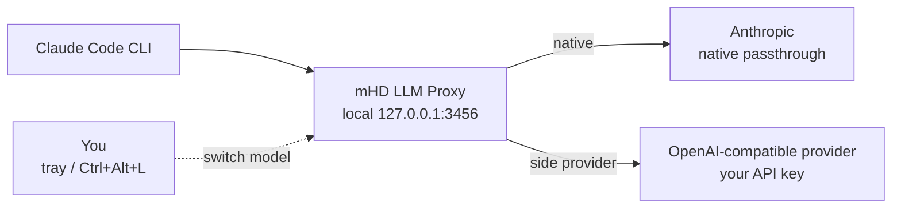

# mHD LLM Proxy

The mHD LLM proxy is a local Claude Code companion. It lets you keep Claude Code running while you switch model routing on the fly between Anthropic native models and OpenAI-compatible providers.

The practical goal is simple: start Claude Code once through the proxy, then use the mHD tray UI or a hotkey to move `opus`, `sonnet`, or `haiku` traffic to another provider and back without restarting Claude Code.

## Quick Start

1. Start `mhd.exe`.
2. Launch Claude Code through the repository wrapper:

   ```powershell
   C:\Workspace\Active\mhd\claude-mhd.bat
   ```

   The wrapper sets:

   ```bat
   ANTHROPIC_BASE_URL=http://127.0.0.1:3456
   ```

3. Open the mHD tray menu:

   ```text
   System tray -> mHD -> right click -> Settings -> LLM Proxy
   ```

4. Add an OpenAI-compatible provider:

   - provider name;
   - endpoint URL, usually ending in `/v1`;
   - API key;
   - one or more model IDs.

5. Open the **Shortcuts** page and bind `show_llm_models` to a convenient key. A common binding is `Ctrl+Alt+L`.
6. Press the shortcut while Claude Code is running and choose the active model route.

Claude Code does not need to be restarted. The next request uses the new route.

## What It Solves

Claude Code normally talks directly to Anthropic. The proxy inserts a local routing layer:



This is useful when you want to:

- keep an active Claude Code session open;
- switch `sonnet` or `haiku` to a cheaper or self-hosted provider;
- switch back to Anthropic native for harder work;
- compare models during the same workflow;
- avoid editing environment variables or restarting the CLI every time.

## Runtime Switching

The proxy keeps a live routing table for model tiers:

| Tier | Meaning |
|------|---------|
| `opus` | Requests whose incoming model name contains `opus`. |
| `sonnet` | Requests whose incoming model name contains `sonnet`. |
| `haiku` | Requests whose incoming model name contains `haiku`. |

Each tier can point to:

- `native` - forward the request to Anthropic;
- a configured upstream model ID - send the request to an OpenAI-compatible provider.

When you switch a tier in the model selector overlay, the proxy updates shared in-memory state and persists the choice. Active streaming responses are not interrupted. The new target is used by the next request for that tier.

## Claude Launcher

The repository includes [`../claude-mhd.bat`](../claude-mhd.bat):

```bat
@echo off
setlocal
set "ANTHROPIC_BASE_URL=http://127.0.0.1:3456"
REM set "ANTHROPIC_AUTH_TOKEN=unused"
call claude %*
```

Use it like the normal `claude` command:

```powershell
C:\Workspace\Active\mhd\claude-mhd.bat
C:\Workspace\Active\mhd\claude-mhd.bat --model sonnet -p "hi"
```

If you have normal Claude Code authentication, leave the wrapper as-is. For providers that do not require Anthropic authentication, the commented `ANTHROPIC_AUTH_TOKEN=unused` line can be enabled so the SDK has a token value to send.

## Provider Setup

Use the native settings UI:

```text
System tray -> mHD -> right click -> Settings -> LLM Proxy
```

The LLM Proxy page manages:

- proxy enabled state;
- bind address and port;
- OpenAI-compatible providers;
- provider endpoints;
- API keys;
- model lists;
- default tier targets;
- optional downgrade toggles;
- debug logging level.

Provider endpoints should be OpenAI-compatible chat/completions APIs, typically:

```text
https://your-provider.example/v1
```

Model IDs should match the provider's `/models` result or documented model names.

## Model Selector

Bind the `show_llm_models` action from:

```text
Settings -> Shortcuts
```

Example shortcut:

```text
Ctrl+Alt+L
```

The selector shows the configured targets for each Claude tier. Pick `native` to return a tier to Anthropic, or pick one of your configured provider models.

## Tray Tools

The tray menu exposes the operational controls:

- **LLM Models** - open the model selector.
- **LLM Proxy on/off** - toggle the embedded proxy server.
- **Proxy Trace** - inspect recent routing decisions.
- **Settings -> LLM Proxy** - configure providers, models, keys, and defaults.

## Trace View

The proxy trace overlay shows recent requests and routing decisions. It is useful for checking:

- which tier Claude Code requested;
- which target the proxy selected;
- whether traffic went to Anthropic native or a provider;
- whether an automatic downgrade rule changed the target;
- whether requests are currently in flight.

## Configuration Files

The proxy stores its configuration under:

```text
%USERPROFILE%\.config\mhd\llm-proxy\
```

Files:

| File | Purpose |
|------|---------|
| `settings.json` | Enabled state, port, bind address, log level, upstream base URL, tier targets, downgrade toggles. |
| `secrets.json` | Anthropic and upstream API keys, protected through Windows DPAPI. |
| `providers.json` | OpenAI-compatible provider names and endpoints. |
| `models.json` | Selectable model IDs, display names, providers, and tier tags. |

Older `[llm_proxy]` TOML settings are migrated into these files on startup.

## Routing View

```text
Claude Code CLI
  -> mHD LLM Proxy
  -> Anthropic native
  or
  -> OpenAI-compatible provider
```

For native Anthropic routes, Claude Code's existing auth is passed through. For provider routes, mHD uses the API key configured on the LLM Proxy settings page.

## Smart Downgrade

Manual switching is the primary control. Optional downgrade settings can also route selected mechanical turns to a cheaper model.

The current design is conservative: automatic downgrade is intended for fast tool-loop continuations where Claude Code is mostly processing tool results, while human-facing turns stay on the manually selected ceiling. See [`concept.md`](concept.md) for the reasoning and threshold model.
